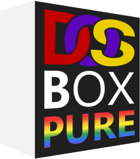
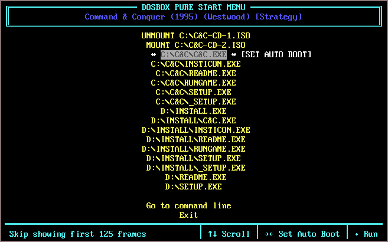
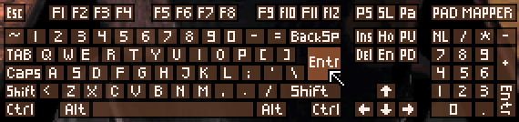
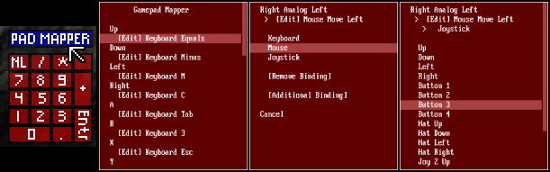

# DOSBox Pure

DOSBox Pure is a fork of [DOSBox](https://www.dosbox.com/), an emulator for DOS games,
built for RetroArch/Libretro aiming for simplicity and ease of use.

* [How To Use](#how-to-use)
* [Manual Install](#manual-install)
* [Features](#features)
    * [Load games from ZIP](#load-games-from-zip)
    * [Store modifications in separate save files](#store-modifications-in-separate-save-files)
    * [Mount disk images from inside ZIP files](#mount-disk-images-from-inside-zip-files)
    * [Installing an Operating System](#installing-an-operating-system)
    * [Start menu with auto start](#start-menu-with-auto-start)
    * [Automated controller mappings](#automated-controller-mappings)
    * [Mouse emulation](#mouse-emulation)
    * [Keyboard emulation](#keyboard-emulation)
    * [Joystick emulation](#joystick-emulation)
    * [On-screen keyboard](#on-screen-keyboard)
    * [Gamepad mapper](#gamepad-mapper)
    * [3dfx Voodoo Emulation](#3dfx-voodoo-emulation)
    * [Multiplayer](#multiplayer)
    * [MIDI playback with SoundFonts or MT-32](#midi-playback-with-soundfonts-or-mt-32)
    * [Cheats support](#cheats-support)
    * [Save states](#save-states)
    * [Rewind support](#rewind-support)
    * [Shared system shells (like Windows 3)](#shared-system-shells-like-windows-3)
    * [Booter games](#booter-games)
    * [Loading M3U8 files](#loading-m3u8-files)
* [Tips](#tips)
    * [Playing with keyboard and mouse](#playing-with-keyboard-and-mouse)
    * [Loading a dosbox.conf file](#loading-a-dosboxconf-file)
    * [ZIP files can be renamed to DOSZ](#zip-files-can-be-renamed-to-dosz)
    * [Force opening the start menu](#force-opening-the-start-menu)
    * [Mount ZIP as A or D drive](#mount-zip-as-a-or-d-drive)
    * [Change disk label with label command](#change-disk-label-with-label-command)
    * [Keyboard layout defaults to US](#keyboard-layout-defaults-to-us)
    * [Save file handling](#save-file-handling)
    * [Reading large files in ZIPs](#reading-large-files-in-zips)
* [Building](#building)
    * [Windows](#windows)
    * [Linux](#linux)
* [License](#license)

## How To Use
The easiest way to use this core is with the built-in core downloader feature of RetroArch.

Just [get RetroArch](https://retroarch.com/?page=platforms) and select `Online Updater` -> `Core Downloader` -> `DOS (DOSBox-Pure)` and you're ready to go!

## Manual Install
You can find a binary download of the core for Windows, Linux and Raspberry Pi (Arm7) under the [Releases page here](https://github.com/schellingb/dosbox-pure/releases/latest).

To install, locate the directory where your libretro frontend stores its cores.  
In RetroArch, you can open the main menu and go to `Configuration File` -> `Load Configuration` -> `Parent Directory` -> `cores` to find it.  
The release ZIP contains 2 files, `dosbox_pure_libretro.dll` (or `.so` for Linux) and `dosbox_pure_libretro.info`.  
The `.dll` or `.so` file is to be extracted into the cores directory. The `.info` file goes into the `info` directory or into `cores` if it doesn't exist.

## Features

### Load games from ZIP
DOSBox Pure can load games directly from ZIP files without the need to extract them.

### Store modifications in separate save files
Changes made to a loaded ZIP file will be stored as a separate ZIP file into the libretro saves directory.  
If a game is loaded directly without using a ZIP file the saves directory is not used.

### Mount disk images from inside ZIP files
CD images (ISO or CUE) and floppy disk images (IMG/IMA/VHD/JRC/TC) can be mounted directly from inside ZIP files.  
The system will automatically mount the first found disk image as the A: or D: drive.  
Additional disks can be loaded or swapped by using the `Disc Control` menu in RetroArch.  
The start menu also offers the option to mount or unmount an image.

### Installing an Operating System
When loading a content that contains a bootable CD-ROM image, the start menu will show an additional option
`[ Boot and Install New Operating System ]`. Additionally it will also show when  both a CD-ROM image and a
floppy disk image are loaded, so non-bootable install CDs can be used as well.

With this option a hard disk image of selectable size (between 8 and 1024 MB) can be created after which
the CD-ROM or floppy disk image will boot to install the operating system. Once the installation has completed,
loading any content (for example a ZIP file) will have the option `[ Run Installed Operating System ]` to boot
the created hard disk image as the C: drive and with the loaded content becoming the D: drive. If there are
any CD-ROM images available they will appear as the E: drive.

There are two core options related to this feature:

- `System > Advanced > OS Disk Modifications`: When running an installed operating system, modifications
  to the C: drive will be made on the disk image by default. Setting it to 'Discard' will never save any
  changes made on C: but allows the content to be closed any time without worry of file system or registry
  corruption. The third option 'Save Difference Per Content' will store any changes made to the C: drive
  into a file in the frontends save directory, but the OS disk image must never be modified again once used,
  otherwise existing differences become unusable.
- `System > Advanced > Force Normal Core in OS`: If you encounter program errors or crashes inside the
  installed operating system, this option can be used to switch to a more compatible but slower
  mode. The option can be toggled on and off as needed.

It is also possible to create save states while running an installed operating system. This can be used
to skip the startup sequence or even jump directly to the title screen of a game. Make sure to load the
same operating system and do not modify the loaded ZIP file in any way otherwise the operating system
will be very confused and most likely crash. To make things easier, set the operating system to 
[auto start](#start-menu-with-auto-start) so it starts together with the content and skipping the start menu.

### Start menu with auto start

This is the first screen that appears when loading a game. It offers a gamepad controllable list
of all executable files for the loaded game. By pressing right an item can be selected as the default
which will skip the menu on the next launch.  
By pressing right multiple times, a number of frames can be specified that will automatically be skipped
on start. This can be used to skip over loading screens or start-up sequences.  
If there is only a single executable, the menu will not show and directly run the file.  
To force the menu to be shown, hold shift on the keyboard or L2 or R2 on
the gamepad while selecting `Restart` in the core menu.

### Automated controller mappings
When a game is loaded, DOSBox Pure will try to detect the game and apply a controller mapping.  
To see the applied mapping, check Controller Port 1 under the "Controller Mapper" tab of the start menu.
It will show `Mapping: <GAMENAME>`. Additionally you can set the core option
`Input > Advanced > Automatic Game Pad Mappings` to `Enable with notification on game detection`.

### Mouse emulation
Under the "Controller Mapper" screen in the start menu there are 2 mouse emulation modes available by
switching the `Preset` setting of any port. There is `Mouse with Left Analog Stick` and
`Mouse with Right Analog Stick`.  
When choosing left stick, the face buttons (B/A) will be used as left/right mouse buttons.  
For the right stick the shoulder buttons L/R will be used as left/right mouse buttons.  
The X button is the middle mouse button and L2/R2 can be used to speed up or slow down mouse movement.  
There is also the core option `Input > Mouse Sensitivity` to increase/decrease mouse movement speed.

The behavior of a real mouse or touch screen can be controlled by the `Input > Mouse Input Mode` option.
- Virtual mouse (default) (best used when the frontend [grabs the mouse input](#playing-with-keyboard-and-mouse))
- Direct controlled mouse (not supported by all games)
- Touchpad mode (drag to move, tap to click, etc., best for touch screens)
- Off (ignore mouse/touch inputs)

In Windows 3.x it is possible to use [this driver](https://github.com/NattyNarwhal/vmwmouse) for direct controlled mouse support.

### Keyboard emulation
For games that don't have automated controller mappings or are not detected successfully the core will map
generic keyboard keys to all buttons. Use the "Controller Mapper" screen in the start menu or the
[On-screen keyboard](#on-screen-keyboard) to freely customize all the mapped buttons.

### Joystick emulation
There are multiple DOS era joysticks available as mappings under the "Controller Mapper" screen in the start menu.  
`Gravis GamePad (4 Buttons)`, `First 2 Button Joystick` (2 Axes), `Second 2 Button Joystick` (2 Axes),
`ThrustMaster Flight Stick` (3 axes, 4 buttons, 1 hat) and `Both DOS Joysticks` (4 axes, 4 buttons).  
These can be assigned to any port and the button layout can be freely remapped.

### On-screen keyboard

By pressing L3 on the gamepad (usually by pushing in the left analog stick) the on-screen keyboard will open.
The cursor can be controlled with the controller (or mouse or keyboard) and L2/R2 will speed up or slow down
the move speed.  
If the cursor is moved above the middle of the screen the keyboard will move to the top.
The button can be remapped in the controls menu and there is also a core option to disable it entirely.

The L3 button can be changed to a different button with the [Gamepad mapper](#gamepad-mapper).

### Gamepad mapper

If you need even more customization of the controls than provided by the [Automated controller mappings](#automated-controller-mappings),
or the various presets for [mouse](#mouse-emulation), [keyboard](#keyboard-emulation) and [joysticks](#joystick-emulation) you can use
the gamepad mapper.

To open it, select "CONTROLLER MAPPER" in the start menu or click the "PAD MAPPER" button in the [On-screen keyboard](#on-screen-keyboard).

It is available any time in-game and changes are immediately saved and applied when closing the mapper. Up to 4 functions can be mapped
for any button/direction of the gamepad. A mapping can be to any function of the 3 emulated input devices: keyboard, mouse or joystick.

### 3dfx Voodoo Emulation
The core includes emulation of a 3dfx Voodoo PCI card. Compatible DOS games should work out of the box. If running an
[installed operating system](#installing-an-operating-system) like Windows 95 or Windows 98, you can get the required drivers
from [this site](https://www.philscomputerlab.com/drivers-for-voodoo.html). Download and launch voodoo_graphics_driver_kit_version_3.01.00.zip
with the core, then run the operating system and install the driver via the control panel from the files on the D: drive.

There are two core options related to this feature:

- `Video > 3dfx Voodoo Emulation`: By default a 12 MB memory card with two texture mapping units is emulated.
  It can be changed to a single TMU 4MB card or support can be disabled entirely.
- `Video > 3dfx Voodoo Performance Settings`: Some options to modify the rendering behavior are available. Setting
  it to 'low quality' only gives a small performance improvement. Disabling multi-threading is possible for example
  if your device gets too hot while using it but in general is not recommended.

### Multiplayer
The core emulates an IPX DOS driver and a serial modem (configurable to be a null modem or dial-up modem) as well as a
NE2000 network card to be used in a [booted operating system](#installing-an-operating-system). To use it, just host
or connect a multiplayer game with a supported frontend (RetroArch 1.16 and newer).

To use the NE2000 card make sure to configure the Windows 95/98 driver to use base address port set to 0x300 and base IRQ set to 10.

### MIDI playback with SoundFonts or MT-32
If DOSBox Pure finds one or more `.SF2` sound font file in the `system` directory of the frontend, one of them
can be selected via the `Audio > MIDI SoundFont` core option. This sound font will then be used to play General Midi and Sound Canvas music.

If the `system` directory contains a pair of `_control.rom` and `_pcm.rom` files, an MT-32 synthesizer can be emulated with them.

Alternatively if the content mounted to the C: drive contains a file named DOSBOX.SF2 or MT32_CONTROL.ROM/MT32_PCM.ROM, it will be used as a per-game override to the core option.

### Cheats support
DOSBox Pure exposes its memory for cheats in the libretro frontend.  
For details how to use it and how to find new cheats while playing the game,
check the [documentation on the RetroArch website](https://docs.libretro.com/guides/cheat-codes/).  
This can also be used to add controller rumble support to DOS games.

### Save states
The DOSBox Pure core fully supports libretro save states.  
Make sure to test it in each game before using it. Complex late era DOS games might have problems.  
Be aware that states saved with different video or cpu settings are not loadable.  
Save states might not be compatible across different versions of DOSBox Pure.

### Rewind support
Using the core option `Save States Support`, rewinding can be enabled.  
Keep in mind that rewind support comes at a high performance cost.

### Shared system shells (like Windows 3)
If DOSBox Pure finds any `.DOSZ` zip files in the `system` directory of the frontend, they will
get listed in the start menu under a sub-menu with the name `[ Run System Shell ]`.

When a shell is selected, DOSBox Pure will underlay the content of the shell's DOSZ zip file as
the base of the file system of the C: drive.
This way, one installation of (for example) Windows 3.1 can be used for multiple games, keeping the
Windows installation and games in separate ZIP files.

On startup it will look for any of the following files to automatically start the shell:
- C:\WINDOWS.BAT
- C:\AUTOEXEC.BAT
- C:\WINDOWS\WIN.COM

### Booter games
When loading a ZIP file which contains a floppy or hard-disk image or loading such a disk image directly,
the [start menu](#start-menu-with-auto-start) will show an additional option `[BOOT IMAGE FILE]`.
When selected, a list of system modes (emulated graphics card) will be shown and once a mode is selected,
DOSBox Pure will try to boot from the mounted image.
While running a booter game, the mounted disk can be easily swapped with the
[Disc Control menu](#mount-disk-images-from-inside-zip-files) or hotkeys set in the frontend.

### Loading M3U8 files
If the core gets loaded with a `.m3u8` file, all files listed in it will be added to the
disc swap menu. The first image will automatically get mounted as A: or D: drive depending
if it is a CD or floppy disk image.

## Tips

### Playing with keyboard and mouse
To play not with a gamepad but with keyboard and mouse, be sure to use the 'Game Focus'
mode available in RetroArch. By default you can toggle game focus by pressing the
scroll lock key. While game focus is active, the hotkeys are disabled and keyboard will
not cause retro pad button presses (which could cause multiple keys to be pressed at once).

### Loading a dosbox.conf file
If a .conf file gets selected in the frontend, DOSBox Pure will mount the directory of that file as the C: drive and then use it.

Alternatively, a .conf file can get loaded automatically depending on the 'Emulation > Loading of dosbox.conf' core option. There are two modes that can be enabled:
- "Try 'dosbox.conf' in the loaded content (ZIP or folder)" - Will load C:\DOSBOX.CONF automatically if it exists in the mounted ZIP or path
- "Try '.conf' with same name as loaded content (next to ZIP or folder)" - Will automatically load GAME.conf next to GAME.zip if it exists.

If there is a .conf file, DOSBox Pure will load the settings in that file and run the autoexec lines from it (if set).

### ZIP files can be renamed to DOSZ
If your libretro frontend wants to load the content of `.ZIP` files instead of sending it to
DOSBox Pure to load, the files can be renamed from `.ZIP` to `.DOSZ`.  
This is especially useful for CD images in ZIP format which RetroArch refuses to append through its
`Disc Control` menu. Using an M3U8 file also avoids this problem.

### Force opening the start menu
If you have assigned an auto start item in the start menu but want to go back to it,
hold shift on the keyboard or L2 or R2 on the gamepad while selecting `Restart` in the core menu.

### Mount ZIP as A or D drive
If you have a ZIP file you want to load as a fake floppy disk or fake CD-ROM, there are multiple options.  
The easiest is to rename the file from `.ZIP` to `.D.ZIP` (to use the D: drive).  
You can also edit the RetroArch `.LPL` playlist file to add a `#D` after the file like `game.zip#D`.  
A third option is available inside DOSBox Pure with a new remount command that can be called with
`REMOUNT C: D:` to remount the C: drive to D:. This can for example be used in a startup batch file.

### Change disk label with label command
DOSBox Pure by default uses the first word of the ZIP file as the label of the mounted disk.  
Some games require a specific label on a floppy or a CD-ROM so DOSBox Pure offers a new command
to change the label of a mounted disk. For example, `LABEL C: HELLO` changes the label of the C: drive.  
This label is not saved anywhere and needs to be reapplied on every launch so it's best to add the
command in a startup batch file.
You can run the `MOUNT` command to check all mounted disks and their disk label.  

### Keyboard layout defaults to US
The keyboard layout defaults to the US Layout (QWERTY).  
If you need a different layout, you can change the core option `Input > Advanced > Keyboard Layout`.

### Save file handling
When modifications to the file system loaded from a ZIP file happens, modifications are written into
a separate save file. You can find these save files inside the data directory of your libretro frontend
usually in a sub-directory called saves.  
Save files get re-written to disk a short while after a modification happens in the file system.  
The bigger the save, the less often it will be written out.  
Up to 1MB of total save data, it will be written out 2 seconds after the last file modification.
Then gradually until at max 59MB and more, it will be written out 60 seconds after the last file modification.

### Reading large files in ZIPs
When a DOS games opens a large file and wants to read some data from near the end of the file,
DOSBox Pure needs to decompress the entire file to do that. This can be most noticeable when mounting
CD-ROM images from inside ZIP files. Afterwards there is an index buffer which will be used to decompress
random locations of the file and file access will be much faster. This index buffer is stored into the
game save file to avoid having to slowly rebuild it every time the same game is launched.

## Building
DOSBox Pure has no dependency requirements besides a C++ compiler and the standard library.

### Windows
Open `dosbox_pure_libretro.sln` in Visual Studio (all versions from 2012 and up are supported) and press
build to build the `dosbox_pure_libretro.dll` core file.

### Linux
To build under linux, make sure GCC 9 (package g++-9) and GNU Make (package make) are installed.  
Change into the project directory then run `make -j4` to build it.  
The makefile explicitly is set to use g++-9 because there are codegen bugs in GCC 10.2 that affect
any version of DOSBox on certain platforms.  
You can edit the simple Makefile to set a different compiler or add hardware specific compiler flags.

## License
DOSBox Pure, as well as original DOSBox, is available under the [GNU General Public License, version 2 or later](https://www.gnu.org/licenses/old-licenses/gpl-2.0.en.html).
